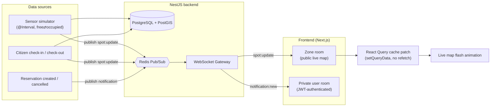

# 🅿️ Smart Parking Prizren

Real-time smart parking platform for the city of Prizren, Kosovo. Live spot availability on an interactive map, zone-based reservations, and an admin dashboard — built on a WebSocket + Redis pub/sub architecture instead of simple polling.

> Part of a civic-tech portfolio series for Prizren. See also: [Prizren Smart City](https://github.com/gentkrasniqii1/prizren-smart-city).

## Features

- 🔴 **Live occupancy map** — parking spot status updates in real time via WebSocket, no manual refresh
- 📍 **Zone & spot management** — PostGIS-backed geospatial data for accurate mapping
- 🅿️ **Reservations** — book a spot in advance with conflict validation
- 📱 **Citizen check-in** — QR-code / manual check-in as a live data source alongside simulated sensors
- 🛠️ **Admin dashboard** — manage zones, spots, and view occupancy analytics
- 🔔 **Live notifications** — check-in/out, reservation confirmations, and 15-min-before reminders pushed over the same authenticated WebSocket
- 📊 **Advanced analytics** — occupancy heatmap and peak-hours chart over PostGIS + sensor/session data
- 🔐 **Role-based access** — citizen / attendant / admin, JWT auth with refresh tokens
- 📚 **Interactive API docs** — full OpenAPI/Swagger UI for every endpoint, generated from the same DTOs that validate requests

## Tech Stack

**Frontend**
- Next.js 14 (App Router) · TypeScript
- TailwindCSS · shadcn/ui
- React Query · Zustand
- Socket.io-client · MapLibre GL

**Backend**
- NestJS · TypeScript
- WebSocket Gateway (Socket.io) · Redis pub/sub
- PostgreSQL + PostGIS · Prisma ORM
- JWT auth (access + refresh) · RBAC
- OpenAPI/Swagger docs (`@nestjs/swagger`) · vitest + supertest (unit + e2e)

**Infra**
- Docker Compose (local dev)
- Deploy: Vercel (frontend) · Railway/Render (backend, Postgres, Redis)

## Architecture

```
smart-parking-prizren/
├── smart-parking-frontend/   # Next.js app
├── smart-parking-backend/    # NestJS API + WebSocket Gateway
└── docker-compose.yml        # Postgres+PostGIS, Redis, backend, frontend
```

Real-time updates flow: sensor simulator / citizen check-in → Postgres write → Redis pub/sub → NestJS Gateway → WebSocket broadcast to clients in the relevant zone room → map updates live on the frontend. Reservation and check-in/out events reuse the exact same pub/sub → Gateway pipeline to push live notifications into a private per-user room — one real-time backbone for both features, not two.



## Getting Started

**Prerequisites:** Node.js 20+, Docker Desktop

```bash
git clone https://github.com/gentkrasniqii1/smart-parking-prizren.git
cd smart-parking-prizren

# Start Postgres + Redis
docker compose up -d

# Backend
cd smart-parking-backend
cp .env.example .env
npm install
npm run start:dev

# Frontend (new terminal)
cd smart-parking-frontend
cp .env.example .env.local
npm install
npm run dev
```

Frontend runs at `http://localhost:3000`, backend API at `http://localhost:3001` — interactive API docs (Swagger UI) at `http://localhost:3001/docs`.

## Deployment

Target architecture: **frontend → Vercel**, **backend + Redis + Postgres/PostGIS → Railway** (Render works the same way). Both `Dockerfile`s are multi-stage with a `dev` target (used by `docker-compose.yml` for local hot-reload) and a production target that's the default when no `--target` is passed — that's the one Railway builds.

1. **Database (PostgreSQL + PostGIS).** Railway's managed Postgres template doesn't include PostGIS, so deploy it as a Docker-image service instead: *New Service → Docker Image* → `postgis/postgis:16-3.4`, with a persistent volume mounted at `/var/lib/postgresql/data` and `POSTGRES_USER`/`POSTGRES_PASSWORD`/`POSTGRES_DB` set. Note its internal connection details.
2. **Redis.** *New Service → Database → Redis* (the stock template is fine — no extensions needed).
3. **Backend.** *New Service → GitHub Repo* → this repo, **Root Directory: `smart-parking-backend`**. Railway detects the `Dockerfile` and builds the production target automatically. Set env vars: `DATABASE_URL`, `REDIS_URL` (from steps 1–2), `JWT_ACCESS_SECRET`/`JWT_REFRESH_SECRET` (generate real random values — **never reuse the `.env.example` placeholders**), `JWT_ACCESS_EXPIRES_IN`, `JWT_REFRESH_EXPIRES_IN`, `PORT=3001`, `SENSOR_SIMULATOR_ENABLED`, `SENSOR_SIMULATOR_INTERVAL_MS`. Expose a public domain. `prisma migrate deploy` runs automatically on every container start (baked into the image's `CMD`) — no separate release/migration step needed. To load the demo seed data once, run `npm run db:seed` in a one-off shell against the deployed service.
4. **Frontend.** Import the repo into Vercel with **Root Directory: `smart-parking-frontend`** (Vercel builds Next.js natively — it does not use the Dockerfile at all). Set `NEXT_PUBLIC_API_URL` and `NEXT_PUBLIC_WS_URL` to the backend's public Railway URL, then deploy.
5. **Close the loop.** Back on the backend service, set `FRONTEND_URL` to the Vercel URL and redeploy — this locks CORS down to just that origin (leaving it unset reflects any origin, which is fine for local dev only).

**Test a production build locally first**, without needing a real Vercel/Railway account:
```bash
docker build -t smart-parking-backend ./smart-parking-backend
docker build --build-arg NEXT_PUBLIC_API_URL=http://localhost:3001 --build-arg NEXT_PUBLIC_WS_URL=http://localhost:3001 -t smart-parking-frontend ./smart-parking-frontend
```
(`docker-compose.yml` itself always builds the `dev` target — it's for local hot-reload, not a production deploy path.)

## Roadmap

- [x] Faza 0 — Scaffold (Next.js + NestJS + Docker)
- [x] Faza 1 — Auth (JWT + RBAC)
- [x] Faza 2 — Zones & Spots CRUD + harta bazë
- [x] Faza 3 — WebSocket real-time + sensor simulator
- [x] Faza 4 — Check-in manual (QR)
- [x] Faza 5 — Rezervimet
- [x] Faza 6 — Admin dashboard
- [x] Faza 7 — Njoftimet (live, via WebSocket)
- [x] Faza 8 — Audit logs + rate-limiting/anti-abuse
- [x] Faza 9 — Analitika e avancuar (heatmap + orët e pikut)
- [x] Faza 10 — Polish UI/UX (basemap real, loading skeletons, nav mobile)
- [x] Faza 11 — Testim backend (unit + e2e, vitest+supertest)
- [x] Faza 12 — Dockerizim final (prod images multi-stage) + udhëzues deploy
- [x] Faza 13 — Dokumentim (Swagger/OpenAPI + diagram arkitekture)

## Live Demo

_Coming soon_

## License

MIT © Gent Krasniqi

## Author

**Gent Krasniqi** — Computer Science student, Prizren
[Portfolio](https://gent-portfolio.vercel.app/) · [GitHub](https://github.com/gentkrasniqii1)
